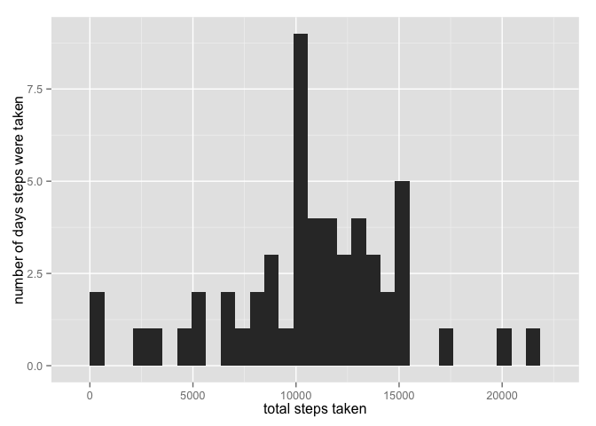
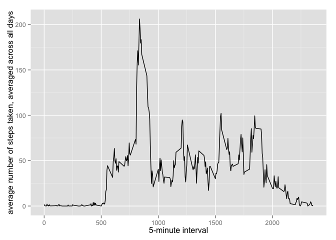
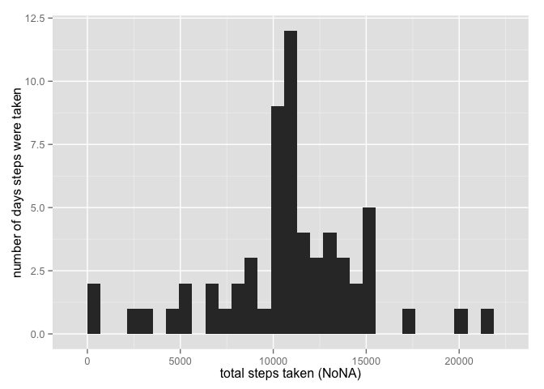
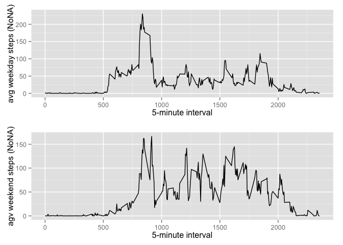

# Assisgnment 1
Joshua Bevan  
July 19, 2014  

# Reproducible Research: Peer Assessment 1

## Loading and Preprocessing the Data:


```r
# Loads File

temp <- tempfile()
download.file("http://d396qusza40orc.cloudfront.net/repdata%2Fdata%2Factivity.zip", temp)
data <- read.csv(unz(temp, "activity.csv"))
unlink(temp)

# Sets Column Classes

data$steps <- as.numeric(data$steps)
data$date <- as.Date(data$date)
data$interval <- as.numeric(data$interval)

# Calculates Total Steps Per Day

stepsday <- aggregate(steps ~ date, data, sum)

# Calculates Average Steps Per Interval & Renames "steps" to "avgsteps"

stepsint <- aggregate(steps ~ interval, data, mean)
names(stepsint) <- sub("^steps$", "avgsteps", names(stepsint))
```

## What is Mean Total Number of Steps Taken Per Day?


```r
# The following function checks to see if the "ggplot2" package is installed, and installs it if it is not.

pkgLoad <- function(x)
  {
    if (!require(x,character.only = TRUE))
    {
      install.packages(x,dep=TRUE, repos='http://star-www.st-andrews.ac.uk/cran/')
      if(!require(x,character.only = TRUE)) stop("Package not found")
    }
      suppressPackageStartupMessages(library(x,character.only=TRUE))
  }
  
  pkgLoad("ggplot2")
```

```
## Loading required package: ggplot2
```

```r
# Creates the histogram displaying how many days a given number of steps were taken.
# See discussion here: https://class.coursera.org/repdata-004/forum/thread?thread_id=29

library(ggplot2)
ggplot(stepsday, aes(x=steps)) + geom_histogram()+ xlab("total steps taken") + ylab("number of days steps were taken")
```

```
## stat_bin: binwidth defaulted to range/30. Use 'binwidth = x' to adjust this.
```

 

```r
# Calculates Mean Steps Per Day

stepsmean <- mean(stepsday$steps)

# Calculates Median Steps Per Day

stepsmedian <- median(stepsday$steps)
```

##### The **_mean_** total number of steps taken is **1.0766 &times; 10<sup>4</sup>**.  The **_median_** total number of steps taken is **1.0765 &times; 10<sup>4</sup>**.

## What is the Average Daily Activity Pattern?


```r
# Creates the Time Series Plot

ggplot(stepsint, aes(interval, avgsteps)) + geom_line() + xlab("5-minute interval") + ylab("average number of steps taken, averaged across all days")
```

 

```r
# Find Max Number of Average Steps

maxint <- stepsint[stepsint$avgsteps == max(stepsint$avgsteps),]
maxavgsteps <- maxint$avgsteps

# Report Interval with Max Number of Average Steps

maxavgint <- maxint$interval
```

##### The most number of steps take is **_206.1698_** in the **_835_** interval.

## Inputting Missing Values:


```r
# Number of Missing Values in Original Data

sum(is.na(data))
```

```
## [1] 2304
```

```r
# Replace NA with Average Steps for Interval

NoNA <- data
NoNA$steps <- ifelse(is.na(NoNA$steps), stepsint$avgsteps[match(NoNA$interval, stepsint$interval)], NoNA$steps)

# Calculates Total Steps Per Day (NoNA)

NoNAstepsday <- aggregate(steps ~ date, NoNA, sum)

# Creates the histogram displaying how many days a given number of steps were taken (NoNA).

ggplot(NoNAstepsday, aes(x=steps)) + geom_histogram()+ xlab("total steps taken (NoNA)") + ylab("number of days steps were taken")
```

```
## stat_bin: binwidth defaulted to range/30. Use 'binwidth = x' to adjust this.
```

 

```r
# Calculates Mean Steps Per Day (NoNA)

stepsmeanNoNA <- mean(NoNAstepsday$steps)

# Calculates Median Steps Per Day (NoNA)

stepsmedianNoNA <- median(NoNAstepsday$steps)
```

##### The **_mean_** total number of steps taken (*NoNA*) is **1.0766 &times; 10<sup>4</sup>**.  The **_median_** total number of steps taken (*NoNA*) is **1.0766 &times; 10<sup>4</sup>**.  By replacing NA values with the average for the given interval, the **_mean_** and **_median_** numbers reverted to the average.

## Are There Differences in Activity Patterns Between Weekdays and Weekends?


```r
# The following function checks to see if the "timeDate" package is installed, and installs it if it is not.
  
  pkgLoad("timeDate")
```

```
## Loading required package: timeDate
```

```r
# Creates Weekday Data

NoNAwd <- NoNA[isWeekday(NoNA$date),]

# Calculates Average Steps Per Interval for Weekdays & Renames "steps" to "avgsteps" (NoNA)

NoNAstepsintwd <- aggregate(steps ~ interval, NoNAwd, mean)
names(NoNAstepsintwd) <- sub("^steps$", "avgsteps", names(NoNAstepsintwd))

# Creates the Time Series Plot for Weekdays (NoNA)

p1 <- ggplot(NoNAstepsintwd, aes(interval, avgsteps)) + geom_line() + xlab("5-minute interval") + ylab("avg weekday steps (NoNA)")

# Creates Weekend Data

NoNAwe <- NoNA[isWeekend(NoNA$date),]

# Calculates Average Steps Per Interval for Weekend & Renames "steps" to "avgsteps" (NoNA)

NoNAstepsintwe <- aggregate(steps ~ interval, NoNAwe, mean)
names(NoNAstepsintwe) <- sub("^steps$", "avgsteps", names(NoNAstepsintwe))

# Creates the Time Series Plot for Weekend (NoNA)

p2 <- ggplot(NoNAstepsintwe, aes(interval, avgsteps)) + geom_line() + xlab("5-minute interval") + ylab("agv weekend steps (NoNA)")

# Load Winston Chang's multiplot Function & Combine Plots

# Multiple plot function
#
# ggplot objects can be passed in ..., or to plotlist (as a list of ggplot objects)
# - cols:   Number of columns in layout
# - layout: A matrix specifying the layout. If present, 'cols' is ignored.
#
# If the layout is something like matrix(c(1,2,3,3), nrow=2, byrow=TRUE),
# then plot 1 will go in the upper left, 2 will go in the upper right, and
# 3 will go all the way across the bottom.
#
multiplot <- function(..., plotlist=NULL, file, cols=1, layout=NULL) {
  require(grid)

  # Make a list from the ... arguments and plotlist
  plots <- c(list(...), plotlist)

  numPlots = length(plots)

  # If layout is NULL, then use 'cols' to determine layout
  if (is.null(layout)) {
    # Make the panel
    # ncol: Number of columns of plots
    # nrow: Number of rows needed, calculated from # of cols
    layout <- matrix(seq(1, cols * ceiling(numPlots/cols)),
                    ncol = cols, nrow = ceiling(numPlots/cols))
  }

 if (numPlots==1) {
    print(plots[[1]])

  } else {
    # Set up the page
    grid.newpage()
    pushViewport(viewport(layout = grid.layout(nrow(layout), ncol(layout))))

    # Make each plot, in the correct location
    for (i in 1:numPlots) {
      # Get the i,j matrix positions of the regions that contain this subplot
      matchidx <- as.data.frame(which(layout == i, arr.ind = TRUE))

      print(plots[[i]], vp = viewport(layout.pos.row = matchidx$row,
                                      layout.pos.col = matchidx$col))
    }
  }
}

multiplot(p1, p2, cols=1)
```

```
## Loading required package: grid
```

 
